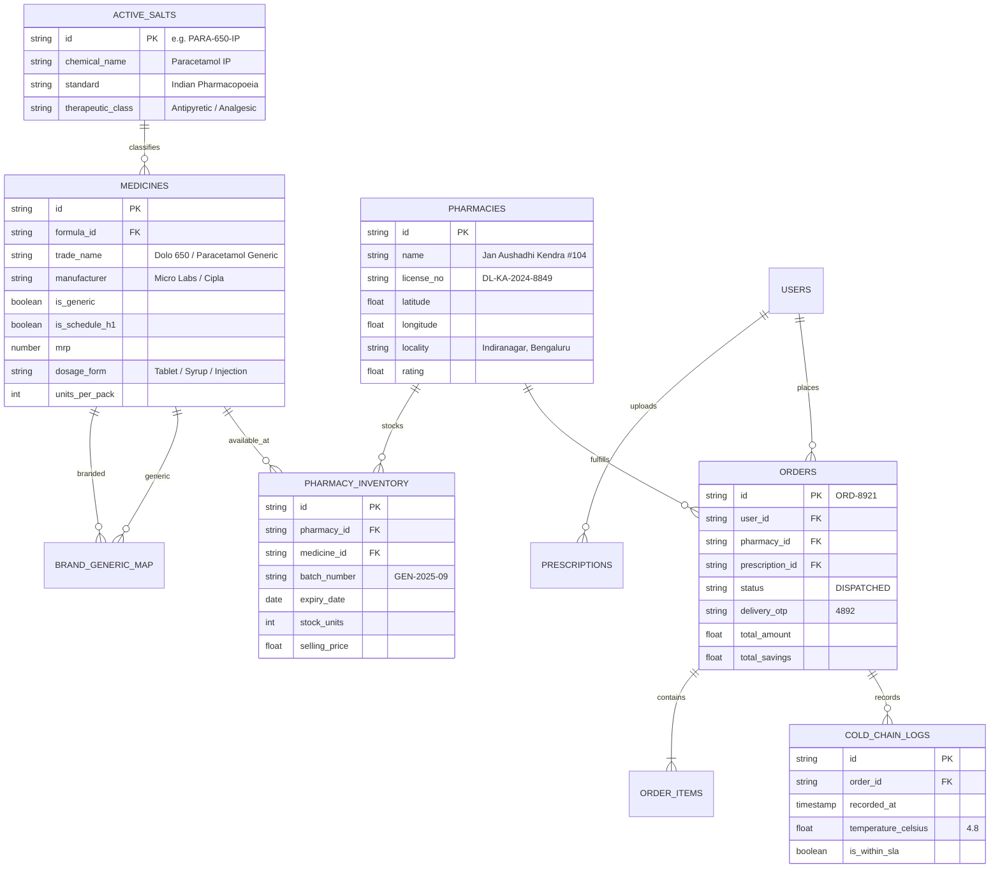

# GenericMed — Long-Term Project Memory

This document serves as the persistent memory and knowledge base for **GenericMed**. Any AI assistant working on this project must consult this document to understand the system context, existing components, domain logic, data models, and pending items.

---

## 1. Project Overview

**GenericMed** is an online generic medicine price comparison and purchase platform designed for the Indian healthcare ecosystem. It empowers patients, caretakers, and chronic illness patients to:
1. **Find Bioequivalent Generic Alternatives**: Compare expensive branded medicines against certified, bio-identical generic equivalents (saving 50%–85% on pharmaceutical expenses).
2. **Standardize Pricing**: Normalize costs on a per-tablet/per-ml basis to eradicate strip-size packaging distortions.
3. **Hyperlocal Dispensary Fulfillment**: Source medicines directly from nearby verified pharmacies (e.g., Jan Aushadhi Kendras, Apollo Pharmacy, MedPlus, Wellness Forever) with rapid 15–45 minute delivery SLAs.
4. **Regulatory & Clinical Rigor**: Enforce strict compliance with the Indian Central Drugs Standard Control Organisation (CDSCO), Schedule H/H1 prescription mandates, cold-chain temperature guarantees (18°C–24°C), and OTP-verified courier handovers.

---

## 2. Technology Stack

| Layer | Technology | Details |
| :--- | :--- | :--- |
| **Frontend Framework** | React 19 (`react@^19.0.1`, `react-dom@^19.0.1`) | Functional components, hooks, modern React transitions |
| **Language** | TypeScript 5.8 (`typescript@~5.8.2`) | Strict typing, full interfaces in `src/types.ts` |
| **Build & Dev Tool** | Vite 6 (`vite@^6.2.3`, `@vitejs/plugin-react@^5.0.4`) | High-speed HMR, port 3000, production bundler |
| **Styling & Design System**| Tailwind CSS v4 (`@tailwindcss/vite@^4.1.14`, `tailwindcss@^4.1.14`) | Semantic CSS custom properties defined in `src/index.css` |
| **Iconography** | Google Material Symbols & Lucide React | `material-symbols-outlined` & `lucide-react@^0.546.0` |
| **Animations** | Motion (`motion@^12.23.24`) & Tailwind Keyframes | Smooth fade-ins, spring transitions, drawer slides |
| **AI Integration** | Google GenAI SDK (`@google/genai@^2.4.0`) | Multimodal OCR prescription extraction & AI pharmacist |
| **Backend / Server Runtime**| Express (`express@^4.21.2`, `tsx@^4.21.0`) | Server-side Gemini API proxy, CDSCO registry integration |

---

## 3. Features Completed

### 3.1 Screens & Core Navigation
- [x] **Compare Screen (`CompareScreen.tsx`)**:
  - Molecule search input with fast salt filter pills (e.g., Paracetamol, Amoxicillin, Atorvastatin, Metformin, Pantoprazole).
  - Side-by-side branded vs. generic visual cards showcasing exact MRP, generic discounted price, rupees saved, and percentage saved (up to 85%).
  - Molecular verification badge ("100% Bio-identical molecule composition", "USP & IP Dissolution Verified").
  - Direct navigation to in-depth chemical breakdown or quick "Add Generic to Cart".
- [x] **Medicine Detail Screen (`MedicineDetailScreen.tsx`)**:
  - Deep-dive into Active Pharmaceutical Ingredient (API), dissolution rate, and bioavailability comparison curve.
  - Hyperlocal pharmacy list with live distance in km, delivery time estimates (e.g., 20 mins), stock status, and per-strip pricing.
  - Price breakdown per tablet to prevent packaging confusion.
- [x] **Cart & Checkout Screen (`CartScreen.tsx`)**:
  - Item listing with quantity increments, batch numbers, and savings summary.
  - Interactive coupon selector (e.g., `FIRSTGENERIC`, `JAN_AUSHADHI_20`).
  - Schedule H1 compliance badge warning if prescription drugs are present in the cart.
  - Delivery address switcher, bill details (Subtotal, Savings, Delivery Fee, Taxes), and Checkout CTA.
- [x] **Order Tracking Screen (`OrderTrackingScreen.tsx`)**:
  - Live dispatch status stepper: Order Placed → Pharmacist Batch Verified → Out for Delivery → Delivered.
  - **Cold-Chain Telemetry**: Live temperature monitor (e.g., 4.8°C / 21.2°C) with carrier status.
  - **OTP Verification Security**: 4-digit delivery security PIN for courier handover.
  - Direct actions: View CDSCO Tax Invoice, SOS Emergency Support, Chat with Pharmacist.
- [x] **Prescriptions Screen (`PrescriptionsScreen.tsx`)**:
  - Digital prescription repository tracking active doctors, clinic names, and upload dates.
  - Prescription status tags: "Verified & Digitized", "Analyzing AI OCR", "Order Ready".
  - One-click prescription upload triggering the OCR parsing modal.

### 3.2 Modal Ecosystem (`src/components/modals/`)
- [x] **`BioequivalenceModal.tsx`**: Interactive comparative bioavailability dissolution graph, IP/BP monograph standards, and safety certificates.
- [x] **`ScheduleH1Modal.tsx`**: CDSCO compliance disclosure explaining legal obligations under the Indian Drugs & Cosmetics Act for Schedule H1 medications.
- [x] **`ArchitecturePRDModal.tsx`**: Cloud architecture diagram and PRD compliance overview (FR-DISC, FR-NORM, FR-CART, FR-ORD).
- [x] **`UploadPrescriptionModal.tsx`**: File drop-zone / camera upload with simulated AI OCR parsing of handwritten doctor prescriptions.
- [x] **`TaxInvoiceModal.tsx`**: GST-compliant medical tax invoice displaying pharmacy drug license number (`DL-KA-...`), patient details, and itemized batch numbers.
- [x] **`ChatPharmacistModal.tsx`**: Live conversational interface with a certified D.Pharm/B.Pharm pharmacist for dosage and generic substitution queries.
- [x] **`AddressModal.tsx`**: Address selection and management for hyperlocal delivery.
- [x] **`SosEmergencyModal.tsx`**: Quick hotline modal for urgent medical escalation, poison control, and ambulance coordination.
- [x] **`NotificationsModal.tsx`**: System notifications for refill reminders, cold-chain dispatches, and price drop alerts.

---

## 4. Pending Features & Technical Debt

- [x] **Live Gemini OCR Pipeline**: Connected `@google/genai` on server side (`geminiService.ts`) with multimodal vision OCR, prompt extraction for doctor registration and brand-to-generic mappings, and client modal integration (`UploadPrescriptionModal.tsx`).
- [x] **Persistent Storage & RBAC (SQLite / PostgreSQL + Prisma)**: Implemented full relational schema in `prisma/schema.prisma` with seed script, JWT authentication, and CDSCO Schedule H1 audit logging (`CdscoAuditModal.tsx`).
- [x] **Dispensary Tenant Dashboard (Phase 3)**: Live multi-tenant pharmacy inventory ledger (`DispensaryPortalModal.tsx`), batch ingestion, and Registered Pharmacist dispensing queue with digital stamp sign-off.
- [x] **Payment Gateway & Batch Allocation (Phase 3)**: Interactive UPI QR / VPA Intent modal (`PaymentGatewayModal.tsx`), automated split settlements, 10-minute temporary inventory reservation lock, and dynamic CDSCO GST invoice generator.
- [ ] **Cold-Chain Telemetry & Geolocation (Phase 4)**: Real-time IoT temperature telemetry ingestion (2°C–8°C / 18°C–24°C) and Mapbox courier tracking.
- [ ] **Live CDSCO Sugam Integration (Phase 5)**: Connect live API ingestion to official government Jan Aushadhi and Sugam CDSCO portals.
- [ ] **Prescription Image Cloud Storage**: S3 / Google Cloud Storage bucket upload with signed short-lived URLs.

---

## 5. API Endpoints Specification (Simulated & Target Backend)

When implementing the backend Express service (`server.js`), these RESTful endpoints must be supported:

### 5.1 Medicine & Molecule Routes
- `GET /api/medicines/search?q=:query&category=:category`
  - Returns bioequivalent pairs matching the search query or active salt identifier.
- `GET /api/medicines/:id/compare`
  - Returns detailed brand vs. generic comparison, dissolution graphs, and manufacturer certificates.
- `GET /api/medicines/:id/pharmacies?lat=:lat&lng=:lng`
  - Returns nearby pharmacies stocking the generic molecule with real-time distance, price per strip, and stock count.

### 5.2 Prescription & AI Vision Routes
- `POST /api/prescriptions/upload`
  - Accepts multipart form data (image/pdf) and stores document securely.
- `POST /api/prescriptions/ocr-analyze`
  - Delegates image to Gemini Vision (`@google/genai`) to parse doctor name, patient name, prescribed branded drugs, and map them automatically to generic salt equivalents.

### 5.3 Cart & Order Fulfillment Routes
- `POST /api/cart/validate`
  - Validates cart items, verifies if Schedule H1 drugs require attached prescription, and calculates normalized delivery fees.
- `POST /api/orders/create`
  - Idempotent order creation generating an Order ID, batch reservations, and UPI payment payload.
- `GET /api/orders/:id/track`
  - Returns current dispatch status, cold-chain temperature telemetry, courier details, and delivery OTP.
- `GET /api/orders/:id/invoice`
  - Generates downloadable CDSCO-compliant GST tax invoice.

---

## 6. Database Schema Summary

The relational model is designed for PostgreSQL / Supabase:



---

## 7. Important Business Logic

### 7.1 Savings & Unit Normalization Formula
```typescript
// Unit Price Normalization
const brandUnitCost = brandPrice / brandPackQuantity;
const genericUnitCost = genericPrice / genericPackQuantity;

// Standardized Savings calculation
const normalizedSavingsRupees = (brandUnitCost - genericUnitCost) * genericPackQuantity;
const savingsPercent = Math.round(((brandUnitCost - genericUnitCost) / brandUnitCost) * 100);
```

### 7.2 Schedule H1 Compliance Gate
```typescript
const hasScheduleH1Items = cartItems.some(item => item.isScheduleH1);
if (hasScheduleH1Items && !attachedPrescriptionId) {
  // Lock checkout and display Schedule H1 Prescription Requirement Modal
  preventCheckoutWithReason("MANDATORY_PRESCRIPTION_REQUIRED");
}
```

### 7.3 Hyperlocal Fulfillment & Split Settlement Accounting
- Orders are routed to the nearest pharmacy meeting:
  1. All order items available in active inventory batches.
  2. Pharmacy within 5 km radius.
  3. Lowest total basket price for the consumer.
- Split settlement ledger:
  - **Dispensary Payout**: 95% of medicine subtotal.
  - **Platform Fee**: ₹5.00 flat convenience rate.
  - **Cold-Chain Logistics**: ₹25.00 insulated carrier fee.

### 7.4 Phase 4: Cold-Chain Telemetry & Cryptographic OTP Handshake
- **Thermal SLA Ranges**:
  - Ambient generic tablets: 18.0°C – 24.0°C
  - Cold-chain biologics/vaccines: 2.0°C – 8.0°C
- **Endpoints**:
  - `GET /api/orders/:id/telemetry`: Real-time temperature series, courier lat/lng, distance remaining, ETA, lid seal state.
### 7.5 Phase 5: National Healthcare Stack (ABDM) & CDSCO Sugam
- **ABDM Integration Contracts**:
  - `POST /api/abdm/verify-abha`: 14-digit ABHA validation (`91-4829-1029-4819`) with Aadhaar OTP authentication (`482910`).
  - `GET /api/abdm/ehr-prescriptions`: FHIR R4 e-prescriptions from linked government hospitals (AIIMS, Safdarjung).
  - `POST /api/abdm/import-prescription`: Ingests hospital e-prescriptions into the user's digital vault with automatic generic substitution mapping.
- **CDSCO Sugam National Drug Recall Registry**:
  - `GET /api/cdsco/sugam/recalls`: National drug recall circulars and substandard formulation bulletins.
  - `GET /api/cdsco/sugam/verify-batch/:batchNumber`: Real-time recall clearance check for dispensary and cart items.
- **Cloud Scale & Container Topology**:
  - `Dockerfile`: Multi-stage build (Vite + Node 20 Alpine + Prisma).
  - `docker-compose.yml`: Web + API services with persistent volume bindings.
  - `k8s/deployment.yaml` & `k8s/service.yaml`: 3-pod rolling update deployment with liveness/readiness probes.
  - `GET /api/metrics`: Kubernetes cluster telemetry, memory, and CDSCO compliance stats.

---

## 8. Current Implementation Status

- **Phase 1 (COMPLETED)**: High-fidelity clinical prototype with molecule comparison, bioequivalence curves, and CDSCO compliance modals.
- **Phase 2 (COMPLETED)**: Express backend with Gemini 2.0 Flash multimodal vision prescription parser, Prisma database, and RBAC authentication.
- **Phase 3 (COMPLETED)**: Hyperlocal dispensary multi-tenancy portal, 10-minute batch locking, UPI payment gateway with split settlements, and dynamic Form 20B/21B GST tax invoices.
- **Phase 4 (COMPLETED)**: Cold-chain IoT BLE telemetry monitoring, dynamic courier route geolocation, cryptographic 4-digit delivery OTP handshake terminal, and PWA offline hardening.
- **Phase 5 (COMPLETED)**: Ayushman Bharat Digital Mission (ABDM) national health stack integration, CDSCO Sugam drug recall registry, and enterprise Docker/Kubernetes cloud scaling.


