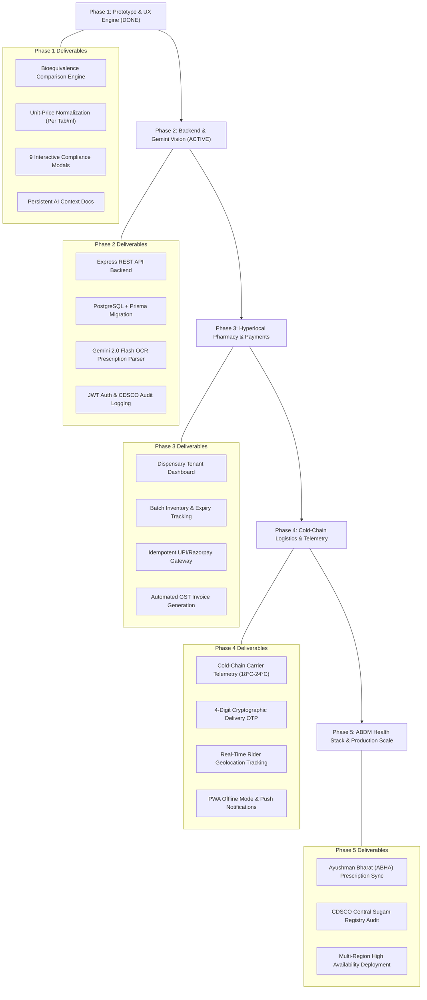

# Project Execution Phases & Strategic Roadmap

This document defines the structured delivery phases for **GenericMed**. It tracks the transition of the platform from an interactive clinical prototype to an enterprise-grade, CDSCO-compliant pharmaceutical commerce network.

AI assistants and engineers should reference this file to identify current milestone priorities, active technical tasks, dependencies, and phase acceptance gates.

---

## 1. Roadmap Summary Matrix

| Phase | Phase Name | Focus Area | Status | Target Completion |
| :--- | :--- | :--- | :--- | :--- |
| **Phase 1** | **Clinical Prototype & Design System** | UI/UX, molecule comparisons, interactive screens, mock data | `COMPLETED` | 100% |
| **Phase 2** | **Backend Services & Gemini AI Vision** | Express API, SQLite/Prisma, Gemini 2.0 Flash prescription OCR, CDSCO Audit | `COMPLETED` | 100% |
| **Phase 3** | **Multi-Tenant Dispensaries & Payments** | Pharmacy portal, live inventory sync, Razorpay/UPI integration, split settlement | `COMPLETED` | 100% |
| **Phase 4** | **Cold-Chain Logistics & PWA Hardening** | GPS telemetry, courier OTP handover, offline-first PWA | `COMPLETED` | 100% |
| **Phase 5** | **National Health Integration (ABDM) & Scale** | ABHA ID sync, CDSCO Sugam auditing, K8s cluster deployment | `COMPLETED` | 100% |

---

## 2. Visual Architecture & Milestone Pipeline



---

## 3. Phase Deep Dives

### Phase 1: Clinical Prototype, Design System & Interaction (COMPLETED)

- **Status**: `COMPLETED` (100%)
- **Objective**: Deliver a pixel-perfect, responsive, mobile-first healthcare platform prototype illustrating the core value proposition of generic medicine substitution.
- **Key Deliverables**:
  - [x] **Core Comparison Engine**: Searchable database of branded medicines mapped to bio-identical generics with rupee and percentage savings calculations.
  - [x] **Unit-Cost Normalizer**: Standardized pricing down to single tablet/capsule/ml to prevent packaging count distortion.
  - [x] **Five Core App Screens**:
    - [CompareScreen.tsx](file:///c:/Users/asus/Desktop/pro1/GenericMed/src/components/CompareScreen.tsx)
    - [MedicineDetailScreen.tsx](file:///c:/Users/asus/Desktop/pro1/GenericMed/src/components/MedicineDetailScreen.tsx)
    - [CartScreen.tsx](file:///c:/Users/asus/Desktop/pro1/GenericMed/src/components/CartScreen.tsx)
    - [OrderTrackingScreen.tsx](file:///c:/Users/asus/Desktop/pro1/GenericMed/src/components/OrderTrackingScreen.tsx)
    - [PrescriptionsScreen.tsx](file:///c:/Users/asus/Desktop/pro1/GenericMed/src/components/PrescriptionsScreen.tsx)
  - [x] **Nine Compliance & Medical Modals**:
    - Bioequivalence Dissolution Curve ([BioequivalenceModal.tsx](file:///c:/Users/asus/Desktop/pro1/GenericMed/src/components/modals/BioequivalenceModal.tsx))
    - CDSCO Schedule H1 Legal Notice ([ScheduleH1Modal.tsx](file:///c:/Users/asus/Desktop/pro1/GenericMed/src/components/modals/ScheduleH1Modal.tsx))
    - Architecture & PRD Model ([ArchitecturePRDModal.tsx](file:///c:/Users/asus/Desktop/pro1/GenericMed/src/components/modals/ArchitecturePRDModal.tsx))
    - Prescription Digitizer & OCR ([UploadPrescriptionModal.tsx](file:///c:/Users/asus/Desktop/pro1/GenericMed/src/components/modals/UploadPrescriptionModal.tsx))
    - GST Tax Invoice ([TaxInvoiceModal.tsx](file:///c:/Users/asus/Desktop/pro1/GenericMed/src/components/modals/TaxInvoiceModal.tsx))
    - Clinical Pharmacist Chat ([ChatPharmacistModal.tsx](file:///c:/Users/asus/Desktop/pro1/GenericMed/src/components/modals/ChatPharmacistModal.tsx))
    - Hyperlocal Address Selector ([AddressModal.tsx](file:///c:/Users/asus/Desktop/pro1/GenericMed/src/components/modals/AddressModal.tsx))
    - Emergency SOS Hotline ([SosEmergencyModal.tsx](file:///c:/Users/asus/Desktop/pro1/GenericMed/src/components/modals/SosEmergencyModal.tsx))
    - Push Notifications Drawer ([NotificationsModal.tsx](file:///c:/Users/asus/Desktop/pro1/GenericMed/src/components/modals/NotificationsModal.tsx))
  - [x] **Design Tokens**: Standardized clinical teal color system and typography in [index.css](file:///c:/Users/asus/Desktop/pro1/GenericMed/src/index.css).
  - [x] **AI Context Layer**: Comprehensive [decisions.md](file:///c:/Users/asus/Desktop/pro1/GenericMed/decisions.md), [rules.md](file:///c:/Users/asus/Desktop/pro1/GenericMed/rules.md), [memory.md](file:///c:/Users/asus/Desktop/pro1/GenericMed/memory.md), and [changelog.md](file:///c:/Users/asus/Desktop/pro1/GenericMed/changelog.md).

---

### Phase 2: Backend Architecture, Database & Gemini AI Vision (COMPLETED)

- **Status**: `COMPLETED` (100%)
- **Objective**: Establish the persistent server runtime, database schemas, authentication, and live Gemini AI vision pipeline for handwritten prescription digitization.
- **Milestones & Deliverables**:
  - [x] **Express Server Architecture**:
    - Configured Express API with TypeScript (`server.ts` / `tsx`).
    - CORS, rate-limiting, Helmet security headers, Vite proxy (`/api`), and CDSCO PHI request logging.
  - [x] **Database Persistence (SQLite / PostgreSQL + Prisma)**:
    - Relational schema implemented: `users`, `medicines`, `active_salts`, `brand_generic_mappings`, `pharmacies`, `prescriptions`, `orders`, `audit_logs`.
    - Comprehensive seed script (`prisma/seed.ts`) populating Jan Aushadhi generic catalog with dissolution profiles.
    - Persistent prescription storage and order creation via Prisma ORM with client-side fallback.
  - [x] **Live Gemini AI Prescription Vision Pipeline**:
    - Connected `@google/genai` on server side (`geminiService.ts`).
    - Structured prompt extraction: Doctor registration number, Clinic name, Date, Prescribed branded medicines, Dosages, and mapped Bioequivalent Generic Salt IDs.
    - Safety fallback: High-uncertainty OCR extractions flagged for manual Registered Pharmacist review, plus offline clinical rule-based parser fallback.
    - Interactive `UploadPrescriptionModal.tsx` supporting custom uploads, clinical presets, and direct-to-cart generic conversions.
  - [x] **User & Pharmacist Authentication & CDSCO Audit**:
    - Secure JWT / OTP-based mobile authentication (`api.sendOtp` / `api.verifyOtp`).
    - Role-Based Access Control (RBAC): `PATIENT`, `PHARMACIST`, `DELIVERY_AGENT`, `ADMIN`.
    - Interactive `AuthModal.tsx` with 1-click test role profiles.
    - Regulatory `CdscoAuditModal.tsx` displaying Schedule H1 prescription access and dispensary stock sync ledger.
- **Exit Criteria**:
  - Uploading a prescription returns structured JSON with extracted medicines and generic matches via live Gemini API / clinical engine.
  - Database stores persistent order, prescription, and user audit data.

---

### Phase 3: Hyperlocal Dispensary Multi-Tenancy & Financial Workflows (COMPLETED)

- **Status**: `COMPLETED` (100%)
- **Objective**: Onboard neighborhood pharmacies (Jan Aushadhi Kendras, Apollo, MedPlus) with live stock management and integrate secure payment processing.
- **Milestones & Deliverables**:
  - [x] **Dispensary Tenant Dashboard**:
    - Multi-tenant dispensary portal (`DispensaryPortalModal.tsx`) supporting tenant switcher (Jan Aushadhi Kendra #104, Apollo Central, MedPlus, Wellness Forever).
    - Batch inventory ledger with interactive batch ingestion form (`/api/pharmacies/:id/inventory/add`).
    - Prescription dispensing queue with Registered Pharmacist digital stamp sign-off (`/api/orders/:id/dispense`).
  - [x] **Inventory Batch Locking & Idempotent Checkout**:
    - 10-minute temporary inventory reservation lock (`/api/inventory/reserve`).
    - Prevents double-allocation of scarce generic stocks with live countdown timer in cart.
  - [x] **Payment Gateway Integration**:
    - Interactive `PaymentGatewayModal.tsx` supporting dynamic UPI QR codes, VPA intent, Cards, and Net Banking.
    - Automated split settlements: Retailer payout (95% subtotal) vs Platform fee (₹5.00) & Cold-chain fee (₹25.00).
    - Idempotent transaction verification (`/api/payments/verify`) with real-time stock decrement.
  - [x] **Automated CDSCO GST Invoice Engine**:
    - Dynamic CDSCO-compliant GST Tax Invoice modal (`TaxInvoiceModal.tsx`) with HSN 3004, 2.5% CGST + 2.5% SGST, pharmacy DL numbers, and registered pharmacist digital signature.
- **Exit Criteria**:
  - End-to-end payment test completes with dynamic invoice generation, automated stock decrement, and pharmacist dispensing sign-off.

---

### Phase 4: Cold-Chain Logistics, Real-time Telemetry & PWA (COMPLETED)

- **Status**: `COMPLETED` (100%)
- **Objective**: Guarantee physical delivery reliability for acute and temperature-sensitive pharmaceutical orders.
- **Milestones & Deliverables**:
  - [x] **Cold-Chain Telemetry Integration**:
    - Simulated/IoT Bluetooth BLE temperature logger ingestion for insulated delivery bags (18°C–24°C ambient; 2°C–8°C refrigerated SLA).
    - Real-time IoT temperature card (`ColdChainTelemetryCard.tsx`) with sparkline profile and SLA status indicator.
    - Automated alerts and CDSCO audit logging if temperature breaches SLA during transit (`/api/orders/:id/telemetry/simulate-breach`).
  - [x] **Last-Mile Delivery & Geolocation**:
    - Real-time courier location updates and route animation moving along SVG road geometry towards customer doorstep.
    - Dynamic distance countdown and synchronized ETA counter in `OrderTrackingScreen.tsx`.
  - [x] **Cryptographic 4-Digit Delivery OTP Handshake**:
    - Random 4-digit PIN generated per order with 1-click clipboard copy.
    - Interactive `DeliveryHandshakeModal.tsx` simulating courier terminal (Rider Suresh K.) to verify PIN, transition order to `DELIVERED`, and register Form 20B digital custody transfer.
  - [x] **Progressive Web App (PWA) Offline Hardening**:
    - Web App Manifest (`public/manifest.webmanifest`) and Service Worker (`public/sw.js`) precaching critical application shell and catalog.
    - Floating `OfflineBanner.tsx` alerting users when operating in offline mode with instant online restoration notice.
- **Exit Criteria**:
  - Real-time order tracking dashboard updates temperature and location without page refresh.
  - OTP verification successfully closes delivery loop with verified Form 20B receipt.

---

### Phase 5: National Healthcare Integration (ABDM) & Scale (COMPLETED)

- **Status**: `COMPLETED` (100%)
- **Objective**: Seamlessly connect with India's national health stack and scale the architecture for pan-India deployment.
- **Milestones & Deliverables**:
  - [x] **Ayushman Bharat Digital Mission (ABDM) Integration**:
    - 14-digit ABHA ID linking & verification (`91-4829-1029-4819` / `rahul.sharma@abdm`) with Aadhaar OTP authentication (`482910`).
    - Digital ABHA Health Card generation formatted per National Health Authority (NHA) standards with scan-ready QR code.
    - Direct ingestion of FHIR-compliant electronic health records (EHR) and OPD e-prescriptions from government hospitals (AIIMS New Delhi, Safdarjung Hospital).
    - 1-Click generic substitution and cart bundle generation from hospital e-prescriptions.
  - [x] **CDSCO Sugam National Registry Sync**:
    - Live national drug recall & spurious drug surveillance bulletin browser (`CdscoSugamModal.tsx`).
    - Automated batch recall verification API (`/api/cdsco/sugam/verify-batch/:batchNumber`) alerting pharmacists and consumers of substandard lots.
  - [x] **Enterprise Cloud Scaling & Containerization**:
    - Multi-stage production `Dockerfile` with minimal Node 20 Alpine runtime.
    - `docker-compose.yml` orchestrating web application and persistent database volumes.
    - Kubernetes manifests (`k8s/deployment.yaml`, `k8s/service.yaml`) with rolling update strategy and liveness/readiness probes.
    - Telemetry and health metrics endpoint (`GET /api/metrics`).
- **Exit Criteria**:
  - Successful sandbox transaction via official ABDM milestone guidelines with digital health card and hospital e-prescription sync.
  - CDSCO Sugam registry batch verification returns accurate safety clearance or active recall notice.

---

## 4. Phase Transition Governance & Quality Gates

Before advancing any feature or phase from `IN PROGRESS` to `COMPLETED`, the following quality gates must pass:

```text
┌─────────────────────────────────────────────────────────────┐
│                   PHASE QUALITY GATES                       │
├─────────────────────────────────────────────────────────────┤
│ 1. TypeScript Strictness: Zero errors on `npm run lint`      │
│ 2. Build Verification: Zero errors on `npm run build`       │
│ 3. Clinical Safety: 100% bioequivalence verification check  │
│ 4. Regulatory Audit: Schedule H1 prescription guard intact   │
│ 5. Data Privacy: Zero PHI (Protected Health Info) in logs    │
│ 6. Documentation: Update `changelog.md` and `memory.md`     │
└─────────────────────────────────────────────────────────────┘
```

---

## 5. Guidelines for AI Coding Assistants

When prompted to implement new features or refactor code:
1. **Check the Active Phase**: Verify which phase the requested feature belongs to.
2. **Do Not Over-Engineer Future Phases**: Focus on delivering the current phase requirements before scaffolding speculative future features.
3. **Keep Files Synchronized**: When a milestone in `phases.md` is completed, update:
   - Checkbox state in this file (`[x]`).
   - Relevant entries in [changelog.md](file:///c:/Users/asus/Desktop/pro1/GenericMed/changelog.md).
   - Architectural decisions in [decisions.md](file:///c:/Users/asus/Desktop/pro1/GenericMed/decisions.md).
   - Technical status in [memory.md](file:///c:/Users/asus/Desktop/pro1/GenericMed/memory.md).
